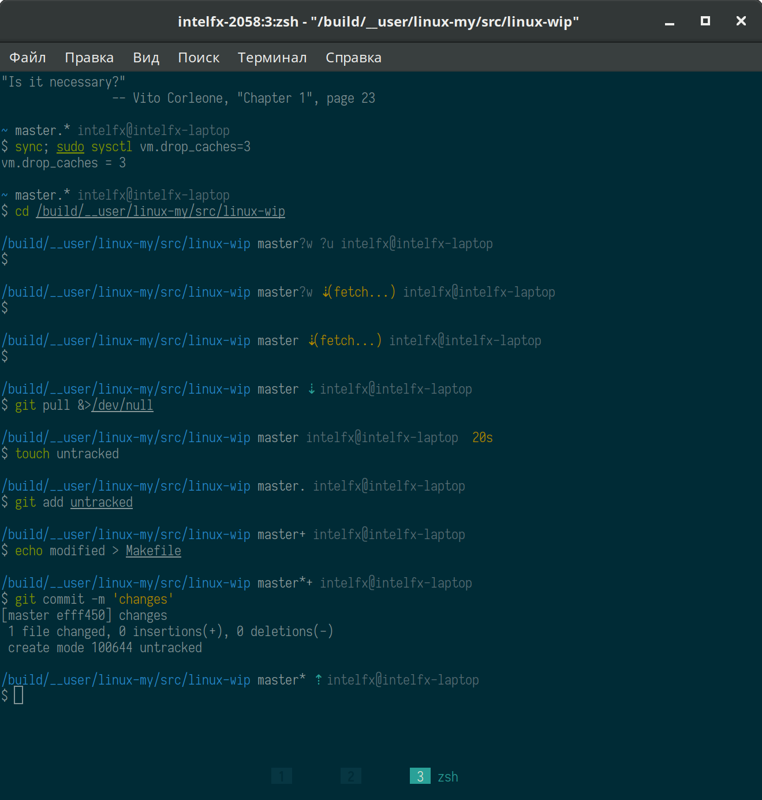

# Pure

> Pretty, minimal and fast ZSH prompt

This is a fork of [sindresorhus/pure](https://github.com/sindresorhus/pure), which aims towards:

- more advanced and fully async git integration (even the branch name resolution does not slow your shell down), and
- [Solarized](https://github.com/altercation/solarized)-friendly colors --- for machines and people!




## Overview

Most prompts are cluttered, ugly and slow. I wanted something visually pleasing that stayed out of my way.


### Why?

- Comes with the traditional `#` and `$` as the prompt characters.
- Shows `git` branch, whether it has modified/staged/untracked files and upstream status with arrows. *All checks are asynchronous.*
- Prompt character turns red if the last command didn't exit with `0`.
- Command execution time will be displayed if it exceeds the set threshold.
- Username and host are colored depending on UID and presence of the SSH session.
- Shows the current path in the title and the current command when a process is running.
- Makes an excellent starting point for your own custom prompt.


## Install

1. I don't care. Install it with whatever tools you want. No hipster-style `npm --global` installation or other bullshit included.

2. Symlink `pure.zsh` to somewhere in [`$fpath`](http://www.refining-linux.org/archives/46/ZSH-Gem-12-Autoloading-functions/) with the name `prompt_pure_setup`.

3. Symlink `async.zsh` in `$fpath` with the name `async`.

#### Example

```console
$ ln -s "$PWD/pure.zsh" /usr/local/share/zsh/site-functions/prompt_pure_setup
$ ln -s "$PWD/async.zsh" /usr/local/share/zsh/site-functions/async
```
*Run `echo $fpath` to see possible locations.*

For a user-specific installation (which would not require escalated privileges), simply add a directory to `$fpath` for that user:

```sh
# .zshenv or .zshrc
fpath=( "$HOME/.zfunctions" $fpath )
```

Then install the theme there:

```console
$ ln -s "$PWD/pure.zsh" "$HOME/.zfunctions/prompt_pure_setup"
$ ln -s "$PWD/async.zsh" "$HOME/.zfunctions/async"
```


## Getting started

Initialize the prompt system (if not so already) and choose `pure`:

```sh
# .zshrc
autoload -U promptinit; promptinit
prompt pure
```


## Options

Option                          | Explanation                                                     | Default
------------------------------- | --------------------------------------------------------------- | ------------
`PURE_CMD_MAX_EXEC_TIME`        | max execution time of a process before it is shown              | `5` seconds
`PURE_GIT_FETCH`                | automatic `git fetch`, done only once per repo                  | `1`
`PURE_GIT_FETCH_RETRY`          | timeout between `git fetch` retries if failed                   | `10` seconds
`PURE_GIT_UNTRACKED`            | enables untracked files in worktree check (disable for speedup) | `1`
`PURE_GIT_DELAY_WORKTREE_CHECK` | timeout between git worktree checks, when they take > 2 seconds | `60`
`PURE_GIT_DELAY_UPSTREAM_CHECK` | timeout between git upstream checks, when they take > 2 seconds | `60`
`PURE_PROMPT_SYMBOL`            | the command prompt symbol                                       | `#` or `$`
`PURE_GIT_DOWN_ARROW`           | git info symbol: branch behind its upstream                     | `⇣`
`PURE_GIT_UP_ARROW`             | git info symbol: branch ahead of its upstream                   | `⇡`
`PURE_GIT_EVEN_ARROW`           | git info symbol: branch is even with its upstream               | empty string
`PURE_GIT_FETCH_IN_PROGRESS`    | git info string: async fetch in progress                        | `(fetch...)`
`PURE_GIT_FETCH_FAILED`         | git info string: async fetch failed, will retry                 | `(fetch!)`
`PURE_GIT_UPSTREAM_NA`          | git info string: async upstream check in progress               | `?u`
`PURE_GIT_WORKTREE_NA`          | git info string: async worktree check in progress               | `?w`
`PURE_DEBUG`                    | debug output in systemd journal (`journalctl -t zshpure`)       | `0`

The worktree/upstream checks are throttled when the last check takes > 2 seconds. This is to save CPU time.

## Example

```sh
# .zshrc

autoload -U promptinit; promptinit

# optionally define some options
PURE_CMD_MAX_EXEC_TIME=10

prompt pure
```


## Tips

To have commands colorized as seen in the screenshot, install [zsh-syntax-highlighting](https://github.com/zsh-users/zsh-syntax-highlighting).


## FAQ

### My preprompt is missing when I clear the screen with Ctrl+L

Pure doesn't register its custom *clear-screen* widget if it has been previously modified. If you haven't registered your own zle widget with `zle -N clear-screen custom-clear-screen` it might have been done by third-party modules. For example `zsh-syntax-highlighting` and `zsh-history-substring-search` are known to do this and they should for that reason be **the very last thing** in your `.zshrc` (as pointed out in their documentation).

To find out the culprit that is overriding your *clear-screen* widget, you can run the following command: `zle -l | grep clear-screen`.

### I am stuck in a shell loop in my terminal that ask me to authenticate. What should I do ?

[This is a known issue](https://github.com/sindresorhus/pure/issues/76).
Using `git pull` when you get the username prompt should help you to break the loop by giving you a real prompt for this. **[This has been fixed in git 2.3](https://github.com/sindresorhus/pure/commit/f43ab97e1cf4a276b7a6e33eac055ee16610be15)**

### I am seeing the error `zpty: can't open pseudo terminal: bad file descriptor`.

[This is a known issue](https://github.com/sindresorhus/pure/issues/117). `zsh/zpty` requires either legacy bsd ptys or access to `/dev/ptmx`. Here are some known solutions.

#### Gentoo

```console
$ sudo sh -c "echo 'SANDBOX_WRITE=\"/dev/ptmx\"' > /etc/sandbox.d/10zsh"
$ sudo emerge -1 zsh
```

#### FreeBSD 10.1

On a default setup, running the command `kldload pty` should do the trick. If you have a custom kernel, you might need to add `device pty` to the configuration file ([example](https://github.com/nbari/freebsd/blob/58646a9c3c4aaabf6f6467ff505f27f09e29dc75/kernels/xen.kernel#L188)).


## License

Original code: MIT© [Sindre Sorhus](http://sindresorhus.com)

Further work: Copyright (c) Ivan Shapovalov

Permission is hereby granted, free of charge, to any person obtaining a copy of this software and associated documentation files (the "Software"), to deal in the Software without restriction, including without limitation the rights to use, copy, modify, merge, publish, distribute, sublicense, and/or sell copies of the Software, and to permit persons to whom the Software is furnished to do so, subject to the following conditions:

The above copyright notice and this permission notice shall be included in all copies or substantial portions of the Software.

THE SOFTWARE IS PROVIDED "AS IS", WITHOUT WARRANTY OF ANY KIND, EXPRESS OR IMPLIED, INCLUDING BUT NOT LIMITED TO THE WARRANTIES OF MERCHANTABILITY, FITNESS FOR A PARTICULAR PURPOSE AND NONINFRINGEMENT. IN NO EVENT SHALL THE AUTHORS OR COPYRIGHT HOLDERS BE LIABLE FOR ANY CLAIM, DAMAGES OR OTHER LIABILITY, WHETHER IN AN ACTION OF CONTRACT, TORT OR OTHERWISE, ARISING FROM, OUT OF OR IN CONNECTION WITH THE SOFTWARE OR THE USE OR OTHER DEALINGS IN THE SOFTWARE.
